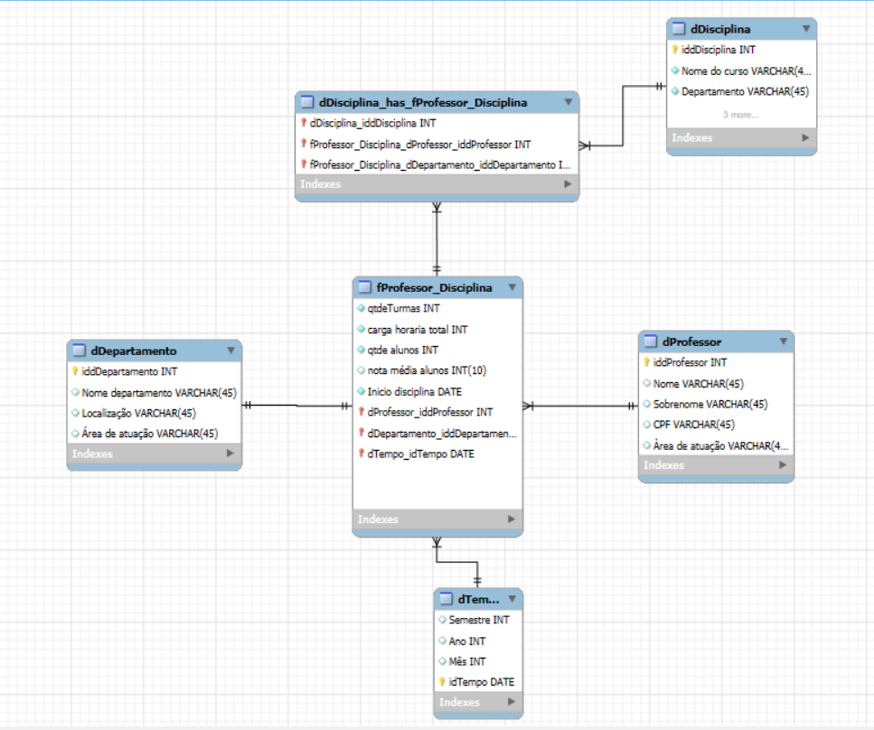

#  Desafio de Modelagem Dimensional — Universidade

## Objetivo
Transformar um modelo relacional de uma **universidade** em um **Star Schema (Esquema em Estrela)** voltado para análise de desempenho acadêmico e docente.

O modelo relacional original incluía entidades como:
- **Aluno**
- **Professor**
- **Disciplina**
- **Departamento**
- **Curso**
- **Matrículas**
- **Pré-requisitos**

O desafio consistiu em **desnormalizar e reorganizar** essas tabelas em um formato analítico, facilitando consultas como:
> "Qual a média de notas dos alunos por professor e disciplina?"  
> "Quantas turmas cada departamento abriu em determinado semestre?"  
> "Qual a carga horária total ministrada por docente ao longo do tempo?"
---

**OBS: este projeto é resposta de um desafio proposto pelo Bootcamp de Analise de dados, parceria entre a plataforma Dio e Klabin.**

O repositório com o desafio original pode ser encontrado em: [Desafio Power BI Curso - Juliana Mascarenhas](https://github.com/julianazanelatto/power_bi_analyst/tree/main/M%C3%B3dulo%204/Desafios%20de%20Projeto)

---

## Modelo Estrela Final

O **modelo final** está representado na imagem abaixo:

---

## Estrutura do Esquema

### **Tabela Fato: `fProfessor_Disciplina`**

Representa o **desempenho das disciplinas ministradas por cada professor** em um determinado período.

| Campo | Descrição |
|--------|------------|
| `qtdTurmas` | Quantidade de turmas ministradas |
| `carga_horaria_total` | Soma da carga horária das disciplinas |
| `qtdAlunos` | Número total de alunos matriculados |
| `nota_media_alunos` | Média de notas obtidas pelos alunos |
| `inicio_disciplina` | Data de início da disciplina |
| `dProfessor_idProfessor` | Chave estrangeira da dimensão Professor |
| `dDepartamento_idDepartamento` | Chave estrangeira da dimensão Departamento |
| `dTempo_idTempo` | Chave estrangeira da dimensão Tempo |

---

### **Dimensão: `dDisciplina`**
Contém informações descritivas sobre as disciplinas.

| Campo | Descrição |
|--------|------------|
| `idDisciplina` | Identificador da disciplina |
| `Nome_do_curso` | Nome do curso ao qual a disciplina pertence |
| `Departamento` | Nome do departamento responsável |

---

### **Dimensão: `dProfessor`**
Armazena informações sobre os docentes.

| Campo | Descrição |
|--------|------------|
| `idProfessor` | Identificador do professor |
| `Nome` | Nome do professor |
| `Sobrenome` | Sobrenome do professor |
| `CPF` | Identificação única (opcional em ambiente analítico) |
| `Área_de_Atuação` | Especialidade do docente |

---

### **Dimensão: `dDepartamento`**
Descreve os departamentos da instituição.

| Campo | Descrição |
|--------|------------|
| `idDepartamento` | Identificador do departamento |
| `Nome_departamento` | Nome do departamento |
| `Localização` | Local físico ou campus |
| `Área_de_Atuação` | Campo de conhecimento principal |

---

### **Dimensão: `dTempo`**
Permite análises ao longo do tempo (por semestre, mês ou ano) - Tabela Calendário.

| Campo | Descrição |
|--------|------------|
| `idTempo` | Identificador de tempo |
| `Semestre` | Número do semestre (1 ou 2) |
| `Ano` | Ano letivo |
| `Mês` | Mês de referência |

---

## 🔗 Relações Principais
- **`fProfessor_Disciplina`** é o **centro da estrela** (tabela fato).
- Conecta-se a:
  - `dProfessor`
  - `dDisciplina`
  - `dDepartamento`
  - `dTempo`

Essa estrutura permite análises **multidimensionais**, por exemplo:
- Nota média de alunos por **professor e semestre**.
- Carga horária total por **departamento e ano**.
- Evolução da quantidade de turmas ao longo do tempo.

---

##  Próximos Passos
- Adicionar uma **dimensão de Aluno** caso sejam necessárias análises mais detalhadas de desempenho individual.  
- Criar uma **tabela de Fato adicional** (`fMatriculas`) para análises de matrículas, retenção e evasão.  

---

 **Resultado:**  

O modelo agora segue a estrutura de *Star Schema* clássica, facilitando análises de desempenho acadêmico e suporte à tomada de decisão no contexto universitário.
